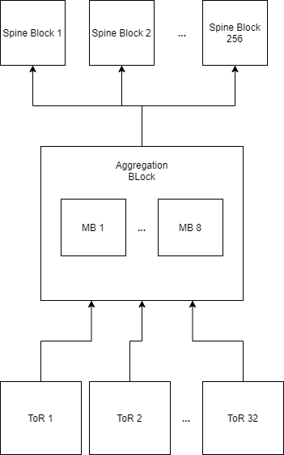

# Google/Facebook DCN Approaches

Both Google and Facebook found themseves in a position where an ever-expanding datacenter footprint required moving from conventional legacy network architectures to Clos architectures. The main goal both companies aimed for was an easily-extensible network fabric allowing for high bandwidth both internally and externally with a 1P+ bisection bandwidth. 

## Designing the Network

Derivations of the fat tree topology are the name of the game, with each company taking a slightly different approach to designing the network. The goal of both networks is a multi-petabit bisection bandwidth, with each host/server receing a 10G uplink to the fabric and 40G links being used between switches. 

Equal-cost multipath routing (ECMP) w/ hashing is used at both companies to ensure load balancing and redundancy.

| Company  | Hierarchy | 
|---|---|
| Google (Jupiter)  | Server -> ToR -> Middle Block/Aggregation Block -> Spine Block  |  
| Facebook | Server -> ToR -> Server Pod -> Spine Plane  |  

### Google

Google's approach involves taking 32 ToR switches and assigning each 2x10G links to 8 so-called "Middle Blocks". These 8 MBs (grouped into an "Aggregation Block") are each supported by 4 switches. The ABs will uplink via 512x40G links to 256 Spine Blocks, each SB supporting up to 64 ABs with 128x40G total downlinks. 

### Facebook

Facebook's approach involves breaking up the network into "server pods" and "spine planes". A server pod is comprised of up to 48 ToR switches and 4 fabric switches. Each of the 4 fabric switches in a server pod is a part of one of 4 spine planes. Each spine plane is suppored by 48 spine switches that link to the edge. 

 
## Deploying Hardware

The key drive for designing these clos networks was affordability and extensibility. From a hardware perspective, instead of purchasing large and expensive proprietary switches and routers from Vendors, each company was able to build a clos network using merchant silicon in custom enclosures. These smaller and relatively inexpensive pieces of equipment allowed the fabric to be quickly upgraded over time in a modular fashion, promoting the idea of a wide network of small inexpensive devices instead of a small newtork of large expensive devices. 

### Google:  Fast Rollouts and Live Tests

Google details the history of their network from 2004-2012 and onwards in multiple revisions: Legacy, Firehouse 1.0 and 1.1, Watchtower, Saturn, and finally Jupiter which is described above. The biggest challenge they faced was reducing the risk involved in rolling out new network infrastructure in production environments without causing outages and putting production server nodes in an experimental networking state. To solve this problem, Google would often redundantly uplink ToR switches to both legacy networks and newer clos fabrics. This allowed their teams to play with the live ammo of new networks without compromising the reliability of production. 

*It is also interesting to note that Google took a very hands-on approach with designing and integrating their own card enclosures during experimentation with various topologies. This is very Google-eque, as they often prefer to design and implement their own solutions instead of turning to the wider market for pre-existing solutions.*

### Facebook: Work Now, Enjoy Later

Facebook's deployment strategy involved starting with a 4:1 oversubscription ratio, using only 12 switches per spine plane instead of the plausible 48-switch max. This makes for an easy upgrade plan, as congestion is spotted and a need to expand is identified, you just add more spine switches to each plane. The more spine switches, the lower the oversubscription ratio. 

They also had the benefit of implemeneting this design in a brand-new data center in Altoona. This allowed for efficient planning of the rack and cabling layouts with clos in mind from the get-go. 

## Software and Control

Both companies leverage a top-down approach for managing the configuration of the fabric. The state is configured and pushed down at the highest level of the stack, then naturally flows down to all the children. With networks that can grow quite large with many devices being managed, this simple approach makes the most sense in lieu of performing manual configuration. 

### Google: If you want something done right, do it yourself

Being in the game a bit earlier than Facebook, Google found itself in a position where existing routing protocols did not satisfy their needs for managin a large homogeneous fabric with ECMP. As is often their prerogative, their own custom control plane was built for a few reasons:

* Existing routing protocols like OSPF/IS-IS/BGP were not mature enough in clos for their needs
* With a large number of physical switches in the network, management needed to be simpler

As such, they designed a solution that would treat the network as one logical fabric with many ports, instead of individually-operating physical units. Now, instead of running distributed systems on a fat network, the network itself was a distributed system made special to cater to Google's unique requirements. 

All the tooling for configuration managemenet was also built in-house to allow Google full control over their environment. 

*As previously mentioned, the common theme with Google is to build as much in-house as possible.*

### Facebook: Software is king

Much like Google, Facebook took a similar approach of designing pure software solutions to managing the complexity of a large network fabric. Their emphasis was on modular code bases that can easily adapt to multiple topologies and hardware platforms. This was accomplished by consolidating configuration into high-level tunable variables, with templating for syntax that allow for adoption into multiple platforms. An emphasis is also placed on monitoring, being dynamically generated by intelligent rulesets and alerting tiers. 

### Devops

Many of these early methodologies adopted for managing the fabrics in stateful ways constitue a "Devops"-like approach to managing infrastucture. Anyone familiar with such configuration management tools as Puppet/Chef and automated deployment tools like Ansible can easily picture the mindset developers of these software management solutions for a clos network. Both Facebook and Google go down the path of stateful management of configuration across multiple hardware platforms using simple code and syntax that can at a high-level apply to virtually anything. In other words, Devops in a nutshell. 

Tools like Ansible (which were initially designed for management of \*nix/Windows OSes) are now also finding a footing in managing newtork equipment, including modules that allow for management of many different kinds of network equipment. Much of what was initially designed in-house by Facebook and Google could likely easily be adopted into open-source Devops tools by future cloud designers. 
